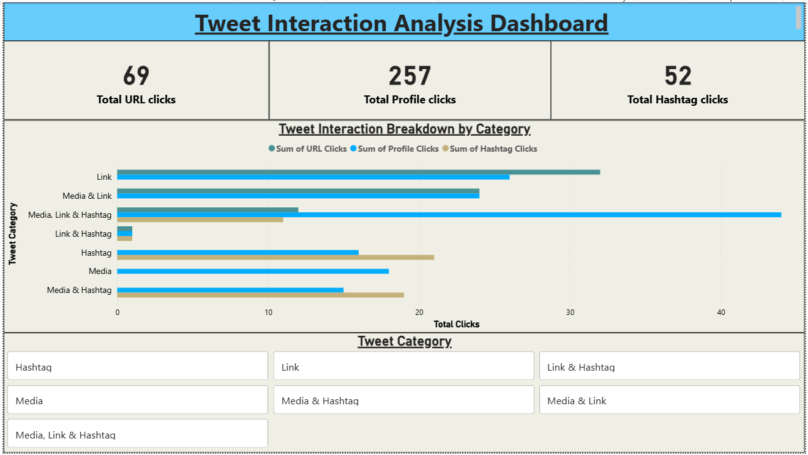
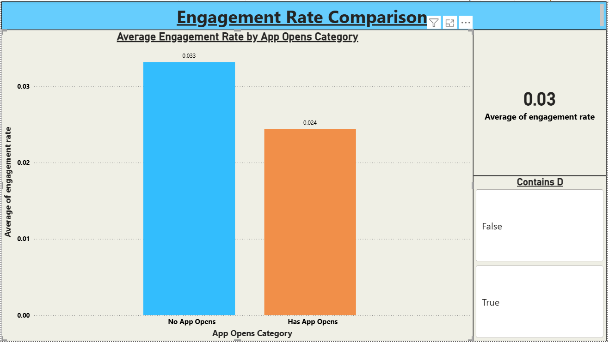
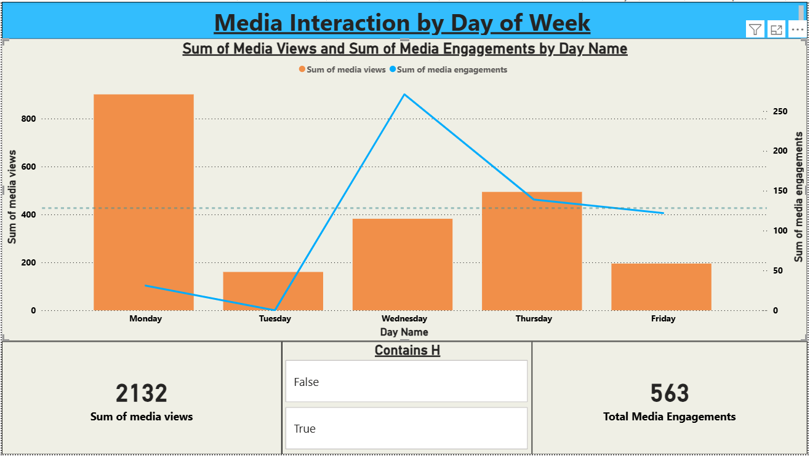
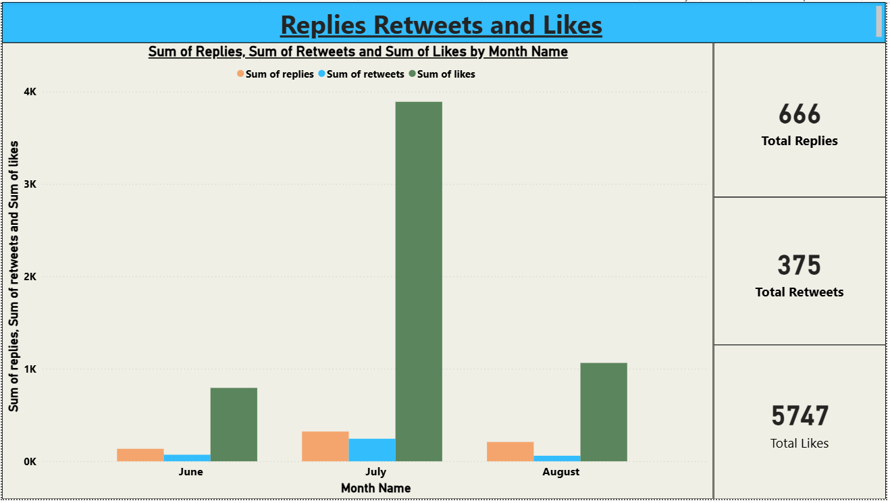
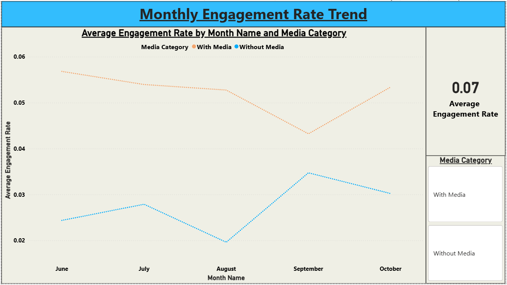
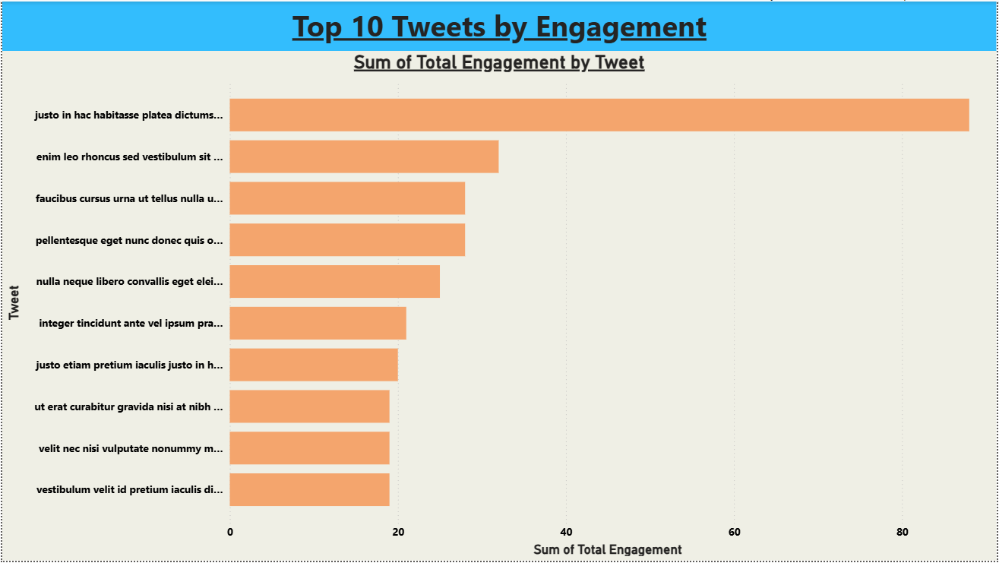

# 📊 Tweet Interaction Analysis Dashboard

A professional multi-page Power BI dashboard analyzing tweet 
interaction patterns across 6 different analytical tasks.

---

## 📸 Dashboard Preview

---

## 🎯 Project Objective

Analyze tweet interaction patterns across multiple dimensions 
including engagement rates, media interactions, replies, retweets, 
likes and top performing tweets using Power BI Desktop.

---

## 📁 Dataset

| Detail | Info |
|---|---|
| **File** | Tweet.xlsx |
| **Source** | Twitter Analytics Export |
| **Total Records** | 1181 tweets |
| **Time Period** | June - October 2020 |

---

## 🔧 Tools Used

| Tool | Purpose |
|---|---|
| Power BI Desktop | Dashboard development |
| Power Query (M Code) | Data transformation |
| DAX | Calculated columns and measures |
| GitHub | Version control and sharing |

---

## 📊 Dashboard Pages

### Page 1 — Tweet Interaction Breakdown by Category

- Clustered bar chart showing URL clicks, Profile clicks and Hashtag clicks by Tweet Category
- Filters: Even dates, Word count > 30, At least one interaction > 0
- Time visibility: 3PM to 5PM IST only

### Page 2 — Engagement Rate Comparison

- Column chart comparing average engagement rate for tweets with and without app opens
- Filters: Odd dates, Character count > 30, Weekdays only, 9AM-5PM tweets
- Time visibility: 7AM-11AM and 12PM-6PM IST
- Interactive Contains D slicer for user control

### Page 3 — Media Interaction by Day of Week

- Dual-axis chart showing media views and media engagements by day of week
- Average reference line to highlight spike days
- Filters: Odd dates, Character count > 30, Last quarter only
- Time visibility: 3PM-5PM and 7AM-11AM IST

### Page 4 — Replies Retweets and Likes

- Clustered column chart comparing replies, retweets and likes by month
- Filters: June to August 2020 only
- No time visibility condition — always visible

### Page 5 — Monthly Engagement Rate Trend

- Line chart showing average engagement rate trend by month
- Two lines — With Media and Without Media
- No time visibility condition — always visible

### Page 6 — Top 10 Tweets by Engagement

- Horizontal bar chart showing top 10 tweets by sum of retweets and likes
- Filters: Odd dates, Even impressions, Word count < 30, Weekdays only
- Time visibility: 3PM to 5PM IST only

---

## ⚠️ Time Visibility Note

Several visualizations are time-locked and only visible during specific IST windows:

| Page | Visible During |
|---|---|
| Page 1 | 3PM - 5PM IST |
| Page 2 | 7AM-11AM and 12PM-6PM IST |
| Page 3 | 3PM-5PM and 7AM-11AM IST |
| Page 4 | Always visible |
| Page 5 | Always visible |
| Page 6 | 3PM - 5PM IST |

---

## 🔍 Key Insights

- Tweets combining multiple interaction types drive significantly higher engagement
- Media tweets consistently outperform non-media tweets in engagement rate
- Monday has highest media views while Wednesday has highest media engagements
- Likes dominate engagement metrics at 15x more than retweets
- July is the strongest month for overall tweet engagement

---

## 🚀 How to Use

1. Download `tweet-interaction-analysis.pbix`
2. Open with **Power BI Desktop** (free download)
3. Update the dataset path to your local Tweet.xlsx location
4. Navigate between 6 pages using the page tabs at the bottom
5. Use slicers to filter data interactively
6. View time-locked visuals during their respective IST windows

---

## 📂 Repository Structure

tweet-interaction-analysis/
│
├── tweet-interaction-analysis.pbix
├── Tweet.xlsx
├── tweet-interaction-dashboard.pdf
├── page1-tweet-interaction.png
├── page2-engagement-rate.png
├── page3-media-interaction.png
├── page4-replies-retweets-likes.png
├── page5-monthly-engagement.png
├── page6-top10-tweets.png
└── README.md
